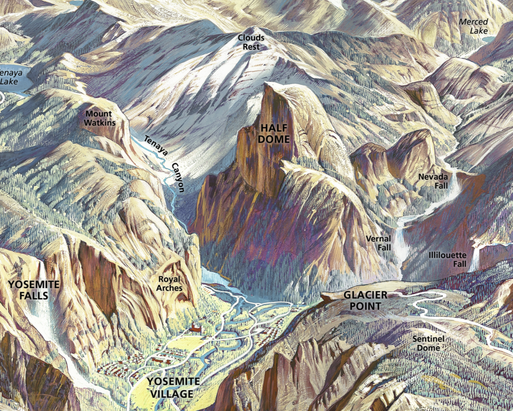
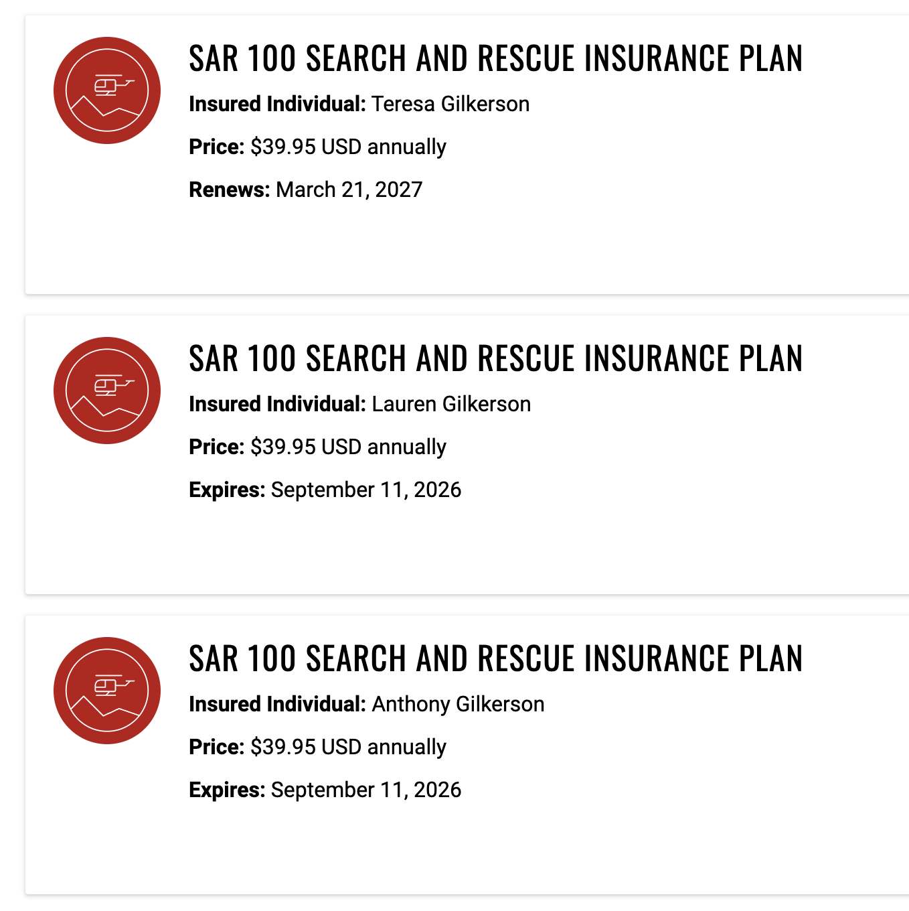

# Yosemite Spring April 2026

Happy Isles/Little Yosemite Valley Spring April 2026

Little Yosemite Valley is the most popular area in the Yosemite Wilderness and I just won the lottery for 3 to stay at Little Yosemite Valley!

* The [Trip Site](https://tonygilkerson.github.io/yosemite/yosemite-spring-2026/) contains a read-only copy of this page and supplementary material to be made available off-line
* **Reservation**: [0843051152-1](https://www.recreation.gov/account/reservations/upcoming](https://www.recreation.gov/account/orders/0843051152/reservations/b843e2c1-e30c-4c66-ba79-dc63e1323d47__445859)) - see [my reservations](https://www.recreation.gov/account/reservations/upcoming) on [www.recreation.gov](https://www.recreation.gov). This reservation can be view using the [recreation.gov mobile app](https://www.recreation.gov/mobile-app)
* See the [Yosemite Guide Brochure](pdf/yosemite-guide-51-3-508V1.pdf) for Yosemite essentials, park map, services, transportation, programs and Valley trails.

## ToDos

- [ ] Install backup copy of onX on TMG's phone
- [ ] Download off-line copy of this page to everyone's phone (aeg to text instructions)
- [ ]  Prepare food and finalize meal plan (AEG)
- [ ]  Estimate how much fuel we need (aeg todo, but LT needs to purchase it once we know)
- [ ]  TBDs for day 5,6 and 7, including any hotel reservations (LT and TMG)
- [ ]  Rental Car (?)

## Hike Visualization

To visualize our hike:

* **Day 1** - We start in the valley (bottom center), hike to the right by **Vernal Falls**, keep going up and to the right to **Nevada Falls**, over the pass an on to base camp at **LYV**

* **Day 2** - Hike up and left to the top of **Half Dome**!, then back down to base camp at **LYV**

* **Day 3** - Hike out to **Quarter Dome** (it is the two peaks visually between Half Dome and Clouds Rest), then back down to base camp at **LYV**

* **Day 4** - Hike back down to the valley but on a different path (high side)

## The Plan

| Trip Day | Day    | Description               | Stay     | Distance Elevation Gain/Loss |
| ----------- | ------ | ------------------------- | -------- | ------------------------------- |
| 0           | Fri 24 | Fly to LA Hotel in LA  | LT's Pad |                                 |
| 1           | Sat 25 | Drive to Yosemite BPCG YV | ⛺️ YV     |                                 |
| 2           | Sun 26 | Hike 1 `-->` LYV          | ⛺️ LYV    | 4.4 mi / 2,395 ft ⬆️             |
| 3           | Mon 27 | Hike 2 `<->` Half Dome    | ⛺️ LYV    | 6.8 mi / 2,685 ft ⬆️ 🔁           |
| 4           | Tue 28 | Hike 3 `<->` Lost Lake    | ⛺️ LYV    | 2.4 mi / 196 ft ⬆️               |
| 5           | Wed 29 | Hike 4 `<--` Out          | TBD      | 5.5 mi / 2,801 ft ⬇️             |
| 6           | Thr 30 | Drive to LA               | TBD      |                                 |
| 7           | Fri 01 | TBD                       | TBD      |                                 |
| 8           | Sat 02 | TBD                       | LT's Pad |                                 |
| 9           | Sun 03 | Fly to Ohio               | Home     |                                 |

* **Little Yosemite Valley (LYV)** - Elevation 6,125 ft
* **Half Dome** - Elevation 8,772 ft
* **Quarter Dome** (QD) - Elevation 8,274 ft
* **Clouds Rest** (CR) - Elevation 9,912 ft

## Hotel Reservation

todo

## Rental Car

todo

## Meal Plan

Status:

* Done preparing and packaging dinner:
  * **Hungry Hiker Stew** x 6
  * **Tony's Spaghetti!** x 6
  * **Mushroom Pasta Alfredo**
  * **Spiced Rice and Beans**
* Next I need to start on breakfast

**Dinner Menu:**

> 🫒 All dinners include an optional organic extra virgin olive oil pack.

- 🥘 **D1 · Hungry Hiker Stew (Sweet Potatoes, No Peas)**  
  Stock: **4 packs**

- 🍲 **D2 · Hungry Hiker Stew (New Potatoes, Peas)**  
  Stock: **2 packs**

- 🍝 **D3 · Mushroom Pasta Alfredo (Angel Hair, Peas)**  
  Stock: **2 packs**

- 🍜 **D4 · Mushroom Pasta Alfredo (Angel Hair, No Peas)**  
  Stock: **2 packs**

- 🌱 **D5 · Mushroom Pasta Alfredo (Edamame Noodles, No Peas)**  
  Stock: **2 packs**

- 🍅 **D6 · Tony's Spaghetti (Angel Hair)**  
  Includes optional parmesan cheese pack  
  Stock: **6 packs**

- 🧄 **D7 · Tony's Spaghetti (Edamame Noodles)**  
  Includes optional parmesan cheese pack  
  Stock: **6 packs**

- 🌶️ **D8 · Spiced Rice & Red Beans**  
  Includes Trader Joe's trail mix for a kick and optional sweet potato pack  
  Stock: **3 packs**

- 🫘 **D9 · Rice & Black Beans**  
  Includes optional sweet potato pack plus salt and pepper packs  
  Stock: **3 packs**

Above is the camp dinner menu. We have 4 camp nights, so please choose 6 meals total: 4 primary choices plus 2 backups.

Each meal is packaged as a half serving, so your 2 backup meals can be used if you are extra hungry or if you want a different option that night.

Text me your order using the meal code and quantity.  
Example: 1xD1, 2xD3, 2xD6, 1xD8

## For Fun

Given that I think we need to assign someone as DJ. To ensure the success of the mission I think all roles need a backup so we need DJ1 and DJ2.  DJ1 is responsible for figuring out how to save tunes off-line and DJ2 is responsible for helping curate a list of songs.

Eventually we need to create a list of roles and who is doing what,  Here is what I have so far:

Need #1 and #2 of each:

* Ranger
* Chef
* DJ
* Navigator (for the car)
* Concierge (for hotel stays)
* What else?

Who ever ends up being DJ1 I want to request the following songs:

- Elton John & Dua Lipa's Cold Heart
- Select songs form Highschool Musical

## Appendix - Half Dome Permits for Backpackers

See [Half Dome Permits](https://www.nps.gov/yose/planyourvisit/hdwildpermits.htm)

If you want to hike to the top of Half Dome as part of your overnight wilderness trip, you can add Half Dome permits for all or some members of your group. You do not need to reserve this in advance; you can simply add it upon request when you pick up your wilderness permit. The cost is $10 per person (paid when you pick up your permits). These Half Dome permits are only available for overnight backpackers and are not valid for day hikers.

Half Dome permits received in this way will be valid for all dates your wilderness permit is valid

## Appendix - LYV Campground

**Summary**

See [Half Dome and Little Yosemite Valley](https://www.nps.gov/yose/planyourvisit/lyv.htm)

* **Food lockers** - food lockers are available
* **Tent** - The campground is minimally developed and there are no check-in or check-out procedures. You may leave your tent up during the day while day hiking.
* **Toilet** - A composting toilet is available for use near the campground!
* **Potable Water** - Potable (drinking) water is not available at the campground. River water is available nearby, at the Merced River.

**Half Dome and Little Yosemite Valley**

Little Yosemite Valley is the most popular area in the Yosemite Wilderness, mainly because it provides easy access to Half Dome. Wilderness permits for the trails leading to Little Yosemite Valley are the most difficult to obtain, and a wilderness permit reservation is strongly recommended. (A permit is now required for day hikers and backpackers hiking to Half Dome.)

**Camping on the Way to Half Dome**

The first camping available is at the Little Yosemite Valley Campground: camping is not permitted between Yosemite Valley and Little Yosemite Valley. If you would like to camp in a dispersed wilderness setting, you must camp at or beyond the Half Dome/John Muir Trail junction or beyond Moraine Dome on the trail toward Merced Lake. Camping is not permitted on top of Half Dome or at Lost Lake.

If you have a wilderness permit for Happy Isles to Little Yosemite Valley or Glacier Point to Little Yosemite Valley, you must camp in Little Yosemite Valley campground on the first night (and may camp there on subsequent nights) of your hike. If you have a permit for another trailhead, you will have to camp elsewhere your first night, but you can stay in Little Yosemite Valley on subsequent nights. If you have a permit for Happy Isles to Merced Lake or Glacier Point to Illilouette, you can not camp in the Little Yosemite Valley area on the first night of your hike.

No other permit or reservation is required to camp at Little Yosemite Valley.

**Little Yosemite Valley Campground**

The campground is minimally developed and there are no check-in or check-out procedures. You may leave your tent up during the day while day hiking.

**Food Lockers**

Bears frequent the Little Yosemite Valley area, so be careful with your food, toiletries, and trash. Your food and related items must be stored in a closed and latched food locker or bear canister unless you're within arm's reach of the food. (Read more about proper food storage or what do to if you see a bear.) Food lockers are communal, so do not store non-food items and do not put padlocks on the lockers. Pack out your trash.

**Campfires**

Fires are allowed in the two communal campfire rings just outside the campground. You may collect dead and down firewood to burn (try to limit yourself to wood smaller than your wrist). Do not burn trash.

**Composting Toilet**

A composting toilet is available for use near the campground. When away from the campground, be sure to bury your waste at least six inches deep and at least 100 feet from any water source and trail. Pack out toilet paper and hygiene products.

**Potable Water**

Potable (drinking) water is not available at the campground. River water is available nearby, at the Merced River. Use established paths to reach the river to prevent habitat and riverbank damage. Treat river water with a giardia-rated filter, by boiling, or with iodine. The river is the only water source for the area; do not wash dishes or clothing in the river. Never use any soap (even if natural or biodegradable) in the river. Do all washing at least 100 feet from the river. Scatter strained dishwater away from the campground and river.

## Appendix - SAR

We are covered!

## Appendix - Garmin Plan

**inReach Enabled Plan**

$7.99 USD per month 
_Plus taxes and fees where applicable_

**Pay-as-you-go for satellite messaging (except unlimited SOS)**

- Unlimited SOS and messaging with Garmin Response℠
- $0.10 USD per check-in message or reaction
- $0.10 USD per tracking point
- $0.50 USD per text message or weather forecast

## Appendix - Reservation Detail From recreation.gov

**Reservation Details**

>**Info Notification**:
>You are required to pick up your permit in person at an onsite issuing station. See the Need to Know and Issuing Station information below for details on picking up your permit.

**Reservation: #0843051152-1**

| Section               | Field            | Value                                                                                                                                                                                |
| --------------------- | ---------------- | ------------------------------------------------------------------------------------------------------------------------------------------------------------------------------------ |
| Facility Details      | Facility Name    | Yosemite National Park Wilderness Permits                                                                                                                                            |
|                       | Location         | Yosemite National Park, California                                                                                                                                                   |
|                       | Permit Status    | Reserved - Reviewed                                                                                                                                                                  |
| Permit Holder Details | Name             | Tony Gilkerson                                                                                                                                                                       |
|                       | Phone            | 6143135840                                                                                                                                                                           |
|                       | Email            | tonygilkerson@yahoo.com                                                                                                                                                              |
|                       | Address          | 2249 Stratford Road, Delaware, OH, USA, 43065                                                                                                                                        |
|                       | Travel Type      | Foot                                                                                                                                                                                 |
| Permit Details        | Reservation Type | Non-Commercial                                                                                                                                                                       |
|                       | Entry Point      | Happy Isles->Little Yosemite Valley (No Donohue Pass)                                                                                                                                |
|                       | Entry Date       | Apr 26, 2026                                                                                                                                                                         |
|                       | Exit Date        | Apr 29, 2026                                                                                                                                                                         |
|                       | Exit Point       | Happy Isles->Illilouette                                                                                                                                                             |
|                       | Comments         | Day 1 - We plan to hike up to Little Yosemite Valley (LYV) and setup camp. Day 2 - Hike up to Half Dome then back to LYV Day 3 - Hike to Lost Lake then back to LYV Day 4 - Hike out |
|                       | Sales Channel    | Online                                                                                                                                                                               |
|                       | Late Arrival     | No                                                                                                                                                                                   |

**Group Size - Passes**

Total Group Size: 3

**Itinerary Details**

| Date         | Camp Area              |
| ------------ | ---------------------- |
| Apr 26, 2026 | Little Yosemite Valley |
| Apr 27, 2026 | Little Yosemite Valley |
| Apr 28, 2026 | Little Yosemite Valley |

**Payment History**

| Date         | Type | Payment Method | Amount |
| ------------ | ---- | -------------- | ------ |
| Nov 11, 2025 | SALE | CARD           | $15.00 |

**Need To Know**

>**Important Information**
>Below you will find important information that regards your stay with us.

**Facility Information**

**This is not your permit.** Please read the following information carefully.

You must pick up your permit in person at any open [Yosemite Wilderness Permit Station](https://www.nps.gov/yose/planyourvisit/permitstations.htm) (stations open seasonally, not limited to your listed issuing station) the day before, or the day of your permit entry date. You must pick up your permit by 11:00 a.m. on your entry date or place it on hold for late pick-up, or it will be canceled. To place your permit on hold, log in to your Recreation.gov account to modify your permit reservation and mark it for late pick-up once you are within one week of your entry date. 

**Other things you need to know:**

* [Bear-Resistant Food Storage](http://www.nps.gov/yose/planyourvisit/bearcans.htm) is required for all overnight stays in Yosemite Wilderness. Bear canisters are available for rent at a [Yosemite Wilderness Permit Station](http://www.nps.gov/yose/planyourvisit/permitstations.htm) for $5 per week (deposit required).

* Check [Current Wilderness Conditions](http://www.nps.gov/yose/planyourvisit/wildcond.htm) for trail conditions and timely updates.

* More information is available on the [Yosemite Backpacking](http://www.nps.gov/yose/planyourvisit/backpacking.htm) page.

* Explore [Public Transportation Options](https://www.nps.gov/yose/planyourvisit/bus.htm) for going to and getting around Yosemite National Park.

* [Backpackers campgrounds](https://www.nps.gov/yose/planyourvisit/bpcamp.htm) (open seasonally) are available for wilderness permit holders to spend one night before and one night after a wilderness trip. Reservations are not required nor necessary. The fee is $8 per person, per night (Payment only via [Recreation.gov Mobile App](https://www.recreation.gov/mobile-app)). No cash.   

**To contact us:**

* Preferred: If you have other questions about reservations please fill out [this form](https://yosemite.org/contact-us/) and we will get back to you within two business days.

* For assistance with your reservation, call 209-372-0740 (Monday through Friday, 9:00 a.m. to 4:00 p.m.).

* If you have general questions about Yosemite Wilderness, call 209-372-0826 (Monday through Friday, 9:00 a.m. to 4:30 p.m.). This number is generally staffed between early May and mid October. 

---

## Appendix - Route Maps

> North is "up" on all maps.

**Day 0**

**Day 1**

**Day 2**

**Day 3**

**Day 4**

---

## Appendix - Recipes

<!-- Don't add any content beyond this point. I have a script that will append the recipes -->

# Black and white  Rice and Beans

A basic meal with just White rice and black beans, salt and pepper.
I made this up based on the other recipes.

| Ingredient             |       Amount | Notes                 |
| ---------------------- | -----------: | --------------------- |
| Instant white rice     |          60g |                       |
| Dehydrated black beans |          30g |                       |
| Salt                   |     0.25 tsp | Adjust as needed      |
| Black pepper           |     0.25 tsp | Optional heat         |
| Extra Virgin Olive Oil | 3 tsp (≈15g) | Add after rehydration |

## Home

* Place all dry ingredients into a vacuum-sealed bag

* Place oil in separate inner package

## Camp

* Empty dry mix into pot or re-hydration bag.

* Add 250–300 ml of hot water, stir well.

* Let sit for 10–12 minutes (insulate if possible), stirring occasionally.

* Once fully re-hydrated, stir in the olive oil.

Enjoy!

# Hungry Hiker Stew

Taken from the _Homemade Dehydrated Camping Food Recipes_

## Ingredients

| Ingredient                                                                           |   Amount | Notes                 |
| ------------------------------------------------------------------------------------ | -------: | --------------------- |
| Dehydrated red kidney beans   or dehydrated TVP crumbles (ground beef substitute) | 40 grams |                       |
| Dehydrated RoTel Diced Tomatoes with Green Chili                                     | 15 grams |                       |
| Dehydrated carrot                                                                    |  5 grams |                       |
| Dehydrated new potato                                                                | 10 grams |                       |
| Dehydrated peas                                                                      | 10 grams |                       |
| Dehydrated corn                                                                      | 10 grams |                       |
| Dehydrated green beans                                                               |  5 grams |                       |
| Lipton Onion Soup & Dip Mix                                                          |    1 Tbsp |                       |
| Worcestershire sauce powder                                                          |    1 tsp |                       |
| Garlic powder                                                                        |    1 tsp |                       |
| Onion powder                                                                         |    1 tsp |                       |
| Ground bay leaf                                                                      |  1/8 tsp |                       |
| Olive oil pack                                                                       |   1 Tbsp | Add after rehydration |

## Home

* Place all dry ingredients into a vacuum-sealed bag

* Place oil in separate inner package

## Trail

* **Cold Soak** - 30 min or more before you reach camp, place dry ingredients in Nalgene bottle. Cover ingredients plus a little extra.  Shake, to mix.

## Camp

* **Hydrate 5 min** - Place dry ingredients in a cooking pot. Pour in enough water to cover the dry ingredients, plus a little extra. Stir well to combine. Cover, and let the dry ingredients hydrate for a minimum of five minutes. Stir well to combine. Add more water if needed to keep the ingredients covered and well-saturated.

* **Boil and simmer 2 min** - Next, bring the hydrating mix to a boil, stirring frequently to mix. Once it boils, reduce the heat to a low simmer for a few minutes. 

* **Cozy for 20 min** - After simmering, turn off the stove and move the pot into cozy to hydrate for 15 to 20 minutes

* **Add oil and Serve** - Once fully hydrated, drizzle olive oil on top

Enjoy.

# Mushroom Pasta Alfredo

Taken from [REI Expert Advice blog](https://www.rei.com/learn/expert-advice/mushroom-pasta-alfredo-backpacking-recipe.html)

## Ingredients

| Ingredient           |                 Amount | Notes                                 |
| -------------------- | ---------------------: | ------------------------------------- |
| Noodles              |                   80 g | weight before cooking and dehydrating |
| Whole milk powder    |                1/4 cup |                                       |
| Butter powder        |               1.5 Tbsp |                                       |
| Italian seasoning    |                1/5 tsp |                                       |
| Garlic powder        |                1/8 tsp |                                       |
| Dehydrated mushrooms |                3 grams |                                       |
| Dehydrated peas      |                3 grams |                                       |
| Sun-dried tomatoes   |                8 grams |                                       |
| Alfredo sauce packet | 1/2 of a 1.5 oz packet |                                       |
| Water                |                  1 cup |                                       |

## Home

* Cook and dehydrate noodles
* Cut sun-dried tomatoes so you have about 8 pieces
* Place dehydrated ingredients, mushrooms, peas and sun-dried tomatoes in separate inner package

## Camp

* Place inner package (mushrooms, peas and tomatoes) and about 1 cup of water in a pot.
* Bring to a boil then remove from heat and place in pot-cozy for 15 min to allow for hydration
* Add remaining ingredients (noodles and powder ingredients), add a little more water if needed and bring to a boil
* Reduce heat to a simmer and continue to cook for about 3 minutes or until noodles are tender and the sauce has thickened.

# Oats

I made this up.

## Ingredients

* 1 cup oats
* 1/8 tsp salt
* 25g sugar
* 1 Tbsp Butter Powder
* 15 grams Raisins or Dried Cranberries
* 1.75 cups water

| Ingredient                       |    Amount | Notes |
| -------------------------------- | --------: | ----- |
| Oats                             |     1 cup |       |
| Salt                             |   1/8 tsp |       |
| Sugar                            |      25 g |       |
| Butter powder                    |    1 Tbsp |       |
| Raisins **or** dried cranberries |  15 grams |       |
| Water                            | 1.75 cups |       |

## Home

* Place dry ingredients; oats, salt, sugar and butter power in vacuum bag
* Place Raisins/Cranberries in separate inner package

## Camp

* Remove inner package and pour contents into a pot
* Add water and bring to a boil
* Simmer for about 1 minutes
* Add raisins and/or cranberries

Alternately you prepare and eat from bag.

* Remove inner package
* Boil water and pour in pouch
* Place in cozy for about 1 minute
* Add raisins and/or cranberries

Enjoy

# Spiced Rice and Beans

White rice and pinto beans

Created with ChatGPT

| Ingredient             |       Amount | Notes             |
| ---------------------- | -----------: | ----------------- |
| Instant white rice     |          60g | Base carb         |
| Dehydrated pinto beans |          30g | Protein + fiber   |
| Onion powder           |        1 tsp | Flavor base       |
| Garlic powder          |      0.5 tsp | Strong flavor     |
| Chili powder           |      0.5 tsp | Mild heat         |
| Paprika powder         |      0.5 tsp | Smoky-sweet       |
| Salt                   |     0.25 tsp | Adjust as needed  |
| Black pepper           |     0.25 tsp | Optional heat     |
| Portuguese seasoning   |      0.5 tsp | Adds savory depth |
| Extra Virgin Olive Oil | 3 tsp (≈15g) | Add after cooking |

## Home

* Mix all dry ingredients (except olive oil) into a resealable bag or vacuum-sealed pouch.

* Pack olive oil separately in a leak-proof container (e.g., mini Nalgene bottle).

## Instructions

* Empty dry mix into pot or rehydration bag.

* Add 250–300 ml of hot water, stir well.

* Let sit for 10–12 minutes (insulate if possible), stirring occasionally.

* Once fully rehydrated, stir in the olive oil.

Enjoy!

# Tonys Spaghetti

I made this one up :-)

## Ingredients

| Ingredient                                  |   Amount | Notes                                                                                          |
| ------------------------------------------- | -------: | ---------------------------------------------------------------------------------------------- |
|  Cut spaghetti                    | 60 grams | Cut pasta works better in the vacuum bags and is easier to eat with a spoon from a meal pouch.  |
| Dehydrated Traditional Pasta Sauce (no oil) | 45 grams | No Oil                                                                                         |
| Dehydrated chopped mushrooms                |  2 grams |                                                                                                |
| Garlic powder                               |  1/2 tsp |                                                                                                |
| Onion powder                                |  1/2 tsp |                                                                                                |
| Italian seasoning                           |  1/4 tsp |                                                                                                |
| Olive oil pack                              |   1 Tbsp |                                                                                                |
| Romano cheese pack                          |   3 Tbsp |                                                                                                |

## Home

* **Mushrooms** - Remove stem and cut into thin pieces to aid in the hydration process

* **Package** - Combine dry ingredients and the two small oil and cheese packs into one vacuum bag

## Camp

* **Unpack** - Pour dry ingredients from two packs into pot, set aside the oil and cheese packs.

* **Heat Water** - Heat water using the Jetboil or a second pot. If you don't have a second pot, cold water works but hot water gives better results.

* **Add Water** - Pour hot water into pot until it just covers the dry ingredients plus a little extra.

* **Hydrate 15 min** - Stir well to combine and place pot in a cozy then set aside to let the dry ingredients hydrate for **15 min**. Add more water if needed to keep the ingredients covered and well-saturated.

* **Simmer 5 min** - Set stove to medium flame and bring the hydrating mix to a boil, stirring frequently to mix. Once it boils, reduce the heat to a low simmer for 5 min.

* **Steep 10 min** - Place pot in a cozy and set aside for to hydrate and steam for 10 min more for flavors to blend and ingredients to fully reconstitute.

* **Serve** - Pour into meal pouch, drizzle oil on top and mix. Finally, sprinkle on the cheese and enjoy!
